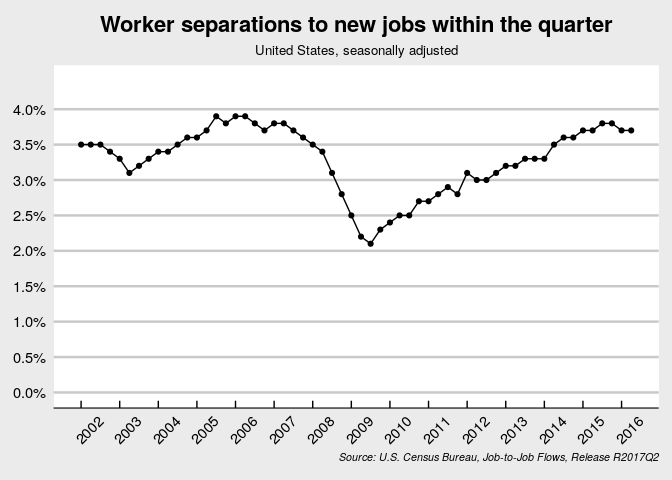

# J2J Report
Lars Vilhuber  
March 8, 2017  


## A toy news release

This is a draft news release for a Census Bureau product called the Job-to-Job (J2J) Flows. It plays around with dynamic text and just basic replicability.

### Setting parameters
First, we need to set some parameters and get the data (if this were a Shiny webapp, that might be a pulldown menu, in particular for the state). First, the key parameters:


```r
j2j.vintage <- "R2017Q2"
j2j.state <- "us"
# We're going to use seasonally adjusted data
j2j.seas <- "s"
# the data area
j2j.urlbase <- "https://lehd.ces.census.gov/data/j2j"
# This should be defined dynamically
j2j.version <- paste(j2j.urlbase,j2j.vintage,"j2j",j2j.state,"version_j2j.txt",sep = "/")
# Sample contents of version_j2j.txt:
# J2J US 00 2000:2-2016:2 V4.2b-draft R2017Q2 j2jpu_us_20170714_2008
schema.vintage <- "V4.2b-draft"
schema.urlbase <- "https://lehd.ces.census.gov/data/schema"
```

Then some more technical parameters:


```r
j2jr.url <- paste(j2j.urlbase,j2j.vintage,"j2jr",j2j.state,sep = "/")
j2jr.file <- paste("j2jr",j2j.state,"all.csv.gz",sep="_")
j2j.url <- paste(j2j.urlbase,j2j.vintage,"j2j",j2j.state,sep = "/")
j2j.file <- paste("j2j",j2j.state,"all.csv.gz",sep="_")
# select all sorts of demo and firm vars
# no testing if they are valid!
j2j.industry <- "00" 
j2j.sex <- "0"
j2j.agegrp <- "A00"
j2j.race <- "A0"
j2j.ethnicity <- "A0"
j2j.education <- "E0"
j2j.firmage <- "0"
j2j.firmsize <- "0"
# or we could simply select the agg_level
# this is the same as all of the above
if (j2j.state == "us" ) j2j.agg_level <- "1" else j2j.agg_level <- "1025"
j2j.plotvar <- "EEHireR"
# and source statement
j2j.source <- paste("U.S. Census Bureau, Job-to-Job Flows, Release",j2j.vintage,sep = " ")
# our preferred format for pct numbers
j2j.fmtpct <- "%1.1f%%"
j2j.fmtbig <- 3
```

We are going to work with seasonally adjusted data from the R2017Q2 release.

### Getting the data
Getting the data implies downloading the files "j2j_us_all.csv.gz" and "j2jr_us_all.csv.gz" from https://lehd.ces.census.gov/data/j2j.

```r
# we need the full data
conr <- gzcon(url(paste(j2j.url,j2j.file,sep="/")))
txt <- readLines(conr)
j2jdata <- read.csv(textConnection(txt))
close(conr)
# and the rates
conr <- gzcon(url(paste(j2jr.url,j2jr.file,sep="/")))
txt <- readLines(conr)
j2jrdata <- read.csv(textConnection(txt))
close(conr)
# mergevars should be derived from metadata, for now we hard-code
mergevars <- names(j2jdata)[1:17]
j2jdata <- merge(x = j2jdata, y=j2jrdata, by=mergevars)

j2jdata$yqstr <- paste(j2jdata$year,j2jdata$quarter,sep="Q")
j2jdata$linyq <- j2jdata$year + (j2jdata$quarter-1)/4
# we also need some metadata. for later.
# get the usps code
#conr <- gzcon(url(paste(schema.urlbase,schema.vintage,"label_stusps",sep="/")))
label.stusps <- read.csv(url(paste(schema.urlbase,schema.vintage,"label_stusps.csv",sep="/")),stringsAsFactors = FALSE)[,c("geography","stusps")]
# get the state name
label.fipsnum <- read.csv(url(paste(schema.urlbase,schema.vintage,"label_fipsnum.csv",sep="/")),stringsAsFactors = FALSE)
states <- merge(label.stusps,label.fipsnum,by=c("geography"),all.y = TRUE)
# some minor cosmetic corrections
states[states$geography == 0,c("stusps","label")] <- c("US","United States")

this.geo <- subset(states,stusps==str_to_upper(j2j.state))
```

## Doing stuff
We now have the data and can do stuff with it.

### The graph
Now we simply plot this:

#### Code for the graph

```r
analysis <- subset(j2jdata,year > 2001 & str_to_lower(seasonadj) == j2j.seas & agg_level == j2j.agg_level)
plotdata <- analysis[,c("year","quarter",j2j.plotvar,"seasonadj","agg_level")]
# scale up the fractions
#plotdata[3] <- plotdata[3]*100
plotdata$yq <- plotdata$year + (plotdata$quarter-1)/4
gg <- ggplot(plotdata,aes_q(x=as.name("yq"),y=as.name(j2j.plotvar))) +
  geom_line() + 
  geom_point() +
  scale_x_continuous(breaks=seq(min(plotdata$year), max(plotdata$year), 1)) +
  scale_y_continuous(labels = scales::percent,
                     breaks=seq(0, max(plotdata[,j2j.plotvar]+0.005), 0.005),
                     limits=c(0,max(plotdata[,j2j.plotvar]+0.005))
                     ) +
  theme_economist_white() +
  theme(
    axis.title.y=element_blank(),
    axis.title=element_text(size=8,face="italic",hjust=1),
    axis.text.x=element_text(angle=+45,hjust=-0.02),
    plot.title = element_text(hjust = 0.5),
    plot.subtitle =element_text(hjust = 0.5),
  ) +
  xlab(paste("Source:",j2j.source,sep = " ")) +
  ggtitle("Worker separations to new jobs within the quarter", paste(this.geo$label,"seasonally adjusted",sep=", ")) 
```
#### The actual graph
<!-- -->

### The text
Now we can reference some of the data as well.

#### Preparing the text

```r
j2j.lyq <- max(analysis$yqstr)
j2j.ly <- subset(analysis,yqstr == j2j.lyq)[1,"year"]
j2j.lq <- subset(analysis,yqstr == j2j.lyq)[1,"quarter"]
j2j.linyq <- j2j.ly + (j2j.lq -1)/4

j2j.refword <- function(cardinal) {
  if ( cardinal == 1 ) tmpsuffix <- "first"
  if ( cardinal == 2 ) tmpsuffix <- "second"
  if ( cardinal == 3 ) tmpsuffix <- "third"
  if ( cardinal == 4 ) tmpsuffix <- "fourth"
  return(tmpsuffix)
}

j2j.compare <- function(this,last) {
  comp <- (this - last)/last * 100
  if ( comp > 0 ) word <- "grew"
  if ( comp < 0 ) word <- "shrunk"
  # 1 percent difference in numbers is unchanged
  if ( abs(comp) < 1 ) word <- "were largely unchanged"
  return(word)
}

j2j.print.pct <- function(data,name) {
  return(sprintf(j2j.fmtpct,
                       round(data[,name]*100,1)
                       )
         )
}

j2j.print.big <- function(data,name) {
  return(format(
            signif(round(data[,name],0),j2j.fmtbig),
            big.mark=",",scientific=FALSE)
         )
}

# pick our poison, for easy reference
j2j.current <- subset(analysis,linyq==j2j.linyq)
j2j.prevq <- subset(analysis,linyq==j2j.linyq - 0.25)
j2j.prevy <- subset(analysis,linyq==j2j.linyq - 1)
```

## The actual text for United States
The fraction of workers changing jobs 
were largely unchanged
in United States
in the second quarter of 2016,
with 4,820,000 
(3.7%) changing employers this quarter, 
compared to 4,670,000 
(3.7%) 
in the second quarter of 2015.
Flows into employment
shrunk, 
with 8,660,000
(6.8%)
employed on the last day of the quarter who did not hold a job on the first day of the quarter,
compared to 6.9% a year ago.
Separations to non-employment 
grew, 
with 8,500,000
(6.6%) 
employed on the first day of the quarter and no longer employed on the last day of the quarter,
compared to 6.5% a year ago.


